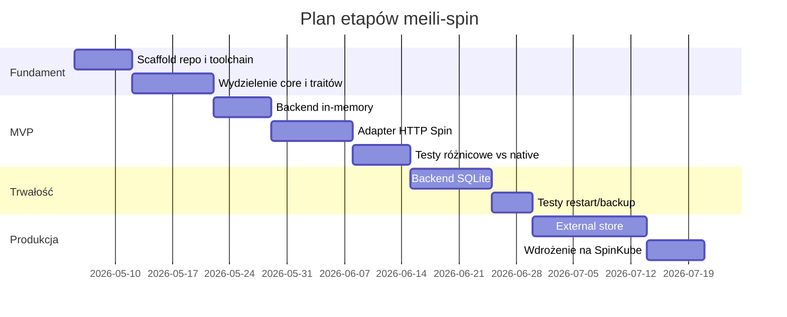

# Wymagania projektu meili-spin

## Streszczenie wykonawcze

Celem repozytorium jest zbudowanie **portu typu subset-first** dla Meilisearch uruchamianego jako komponent HTTP w Spin, z naciskiem na zachowanie najbardziej użytecznej części kontraktu HTTP Meilisearch przy świadomym odejściu od jego natywnego modelu uruchomieniowego. Decyzja o wyborze Meilisearch wynika z tego, że projekt jest niemal w całości napisany w Rust, buduje się z użyciem Cargo, ma oficjalny obraz Docker i jest szeroko używany produkcyjnie; jednocześnie jego główny interfejs jest HTTP, co dobrze pasuje do modelu triggerów Spin. Największym technicznym odstępstwem od upstream będą: zastąpienie magazynu LMDB/mmap, ograniczenie ścieżek zależnych od wątków i systemu hosta oraz rehosting API za pomocą adaptera Spin HTTP. citeturn1view0turn13search0turn14view8turn14view1turn5view0turn14view2

Projekt standardyzuje toolchain na `wasm32-wasip2`, ponieważ jest to oficjalny target Rust dla WASI Preview 2 / Component Model, a dokumentacja Spin v4 (preview) pokazuje już budowanie komponentów Rust pod ten target. Jednocześnie należy jawnie przypiąć wersję Spin w repozytorium, ponieważ część dokumentacji stabilnej nadal pokazuje starsze przykłady `wasm32-wasi/wasip1`; jest to zatem znane miejsce ryzyka wersyjnego, a nie błąd projektu. citeturn1view1turn24search1

## Założenia, cele i zakres

**Cel projektu**

Repozytorium ma dostarczyć działający komponent Spin, który implementuje minimalny, produkcyjnie sensowny podzbiór API Meilisearch dla wyszukiwania dokumentów oraz podstawowej obserwowalności instancji.

**Zakres MVP**

- uruchamianie jako komponent HTTP w Spin;
- implementacja minimalnych endpointów zgodnych semantycznie z upstream;
- indeks i wyszukiwanie dla ograniczonego zbioru danych;
- strategia migracji persystencji: **in-memory → SQLite → external store**;
- testy różnicowe względem natywnego Meilisearch uruchomionego w Dockerze. citeturn5view0turn14view7turn13search2

**Kryteria sukcesu**

- komponent buduje się i uruchamia lokalnie przez `spin build` i `spin up`;
- minimum API działa stabilnie i przechodzi testy integracyjne;
- dla ustalonego zestawu zapytań wyniki są porównywalne z natywnym Meilisearch;
- repo zawiera CI, przykładowy `spin.toml`, dokumentację uruchamiania i plan migracji persystencji.

**Poza zakresem MVP**

- pełna zgodność z całym API upstream;
- LMDB, memory-mapped storage i natywne `data.ms`;
- snapshoty i dumpy zgodne binarnie z upstream;
- zaawansowane funkcje, takie jak many-index federation, vector/hybrid search, facet search, webhooki zadań, multi-tenancy, tenant tokens i pełne zarządzanie kluczami;
- próba uruchamiania „oryginalnego demona” bez zmian w Wasm.

**Założenia niejawne**

- zespół akceptuje **przepisywanie fragmentów w Rust**, jeśli kod upstream nie jest przenośny do Wasm;
- zespół akceptuje **subset-first scope** zamiast pełnej zgodności od pierwszego wydania;
- adapter HTTP Spin jest traktowany jako publiczna powłoka serwera, a nie tymczasowy hack.

## Architektura docelowa

Architektura musi rozdzielać kod przenośny od kodu zależnego od hosta, ponieważ upstream opiera przechowywanie na LMDB i plikach mapowanych w pamięci, a Spin preferuje model komponentu HTTP i host-managed storage, w tym SQLite oraz konfigurację środowiska wykonywania. Dodatkowo obecne WASI nie dostarcza zwykłego interfejsu socketów dla standardowych bibliotek bazodanowych, stąd potrzeba szczelnego rozdziału warstw. citeturn14view1turn5view2turn26search0turn26search3

**Wymagane crate’y**

- `crates/core-portable` — parsowanie zapytań, ranking, filtrowanie, modele dokumentów;
- `crates/storage-traits` — interfejsy magazynu i task queue;
- `crates/storage-memory` — backend fazy MVP;
- `crates/storage-sqlite` — backend fazy drugiej;
- `crates/spin-http-adapter` — mapowanie endpointów HTTP na operacje domenowe;
- `crates/test-harness` — fixture’y danych i porównania z upstream.

**Wymagane pliki repozytorium**

- [ ] `requirements.md`
- [ ] `README.md`
- [ ] `spin.toml`
- [ ] `runtime-config.toml.example`
- [ ] `Cargo.toml` w workspace
- [ ] `rust-toolchain.toml`
- [ ] `.github/workflows/ci.yml`
- [ ] `tests/integration/`
- [ ] `tests/differential/`
- [ ] `scripts/run-native-meili.sh`
- [ ] `scripts/bench.sh`

## Wymagania funkcjonalne

**Minimalny zestaw endpointów wymaganych w MVP**

- `GET /health` — musi zwracać `200` i obiekt statusu zgodny semantycznie z upstream;
- `GET /version` — musi zwracać informacje o wersji portu i, jeśli dostępne, metadane rewizji;
- `GET /indexes` — lista indeksów;
- `POST /indexes/{index_uid}/documents` — dodanie lub pełna zamiana dokumentów; brakujący indeks może zostać utworzony automatycznie;
- `POST /indexes/{index_uid}/search` — podstawowe wyszukiwanie;
- `GET /stats` — statystyki instancji i indeksów;
- `GET /tasks` — lista zadań asynchronicznych lub ich emulacji. citeturn14view3turn14view4turn19search4turn22view1turn22view0turn14view6turn22view2

**Wymagane zachowania**

- `POST /indexes/{index_uid}/search` musi wspierać co najmniej: `q`, `offset`, `limit`;
- puste `q` musi działać jako placeholder search;
- wyszukiwanie powinno zachować semantykę prefix search i typo tolerance tam, gdzie da się ją odtworzyć bez łamania ograniczeń Wasm;
- `POST /indexes/{index_uid}/documents` musi zwracać obiekt zadania, nawet jeśli implementacja wewnętrzna uprości przetwarzanie;
- błędy wejściowe mają być zwracane jako JSON z czytelnym kodem i komunikatem;
- wszystkie trasy poza `/health` mają wymagać autoryzacji Bearer, jeżeli skonfigurowano master key. citeturn22view0turn22view1turn14view5

**Niewymagane w MVP, ale przewidziane w roadmapie**

- `GET /tasks/{id}`
- `GET /indexes/{uid}/documents`
- aktualizacja ustawień indeksu
- częściowa aktualizacja dokumentów
- eksport/import na poziomie formatu portu

## Wymagania niefunkcjonalne i persystencja

**Wydajność i pamięć**

- budżet pamięci musi być konfigurowalny;
- implementacja MVP nie może zakładać obecności LMDB ani pamięci mapowanej;
- projekt ma preferować małe, przewidywalne szczyty pamięci nad maksymalny throughput indeksowania;
- benchmarki muszą raportować opóźnienia wyszukiwania osobno dla warm i cold start oraz porównanie do natywnego Meilisearch na tym samym zbiorze danych. Upstream wskazuje, że natywne indeksowanie jest operacją wielowątkową i pamięciożerną, a przechowywanie jest zoptymalizowane pod LMDB/mmap; port Spin nie powinien próbować odtwarzać tego 1:1 w MVP. citeturn14view1turn14view2

**Trwałość danych**

- **Faza A:** brak trwałości, backend in-memory;
- **Faza B:** trwałość lokalna przez `sqlite_databases = ["default"]`;
- **Faza C:** zewnętrzny store po HTTPS lub host-managed DB zgodna z runtime. Spin udostępnia wbudowane SQLite oraz runtime configuration do mapowania pliku lub zdalnego libSQL; jednocześnie wsparcie API należy jawnie sprawdzać względem docelowego środowiska. citeturn26search0turn26search3turn23view0

**Strategia migracji**

- dane testowe i fixtures muszą być przenaszalne między backendami;
- kontrakt `storage-traits` nie może przeciekać szczegółów SQLite;
- backup w fazie B ma być realizowany na poziomie pliku SQLite lub snapshotu storage hosta, a nie przez natywne dumpy/snapshoty Meilisearch;
- przy przejściu do external store należy zachować zgodność semantyczną endpointów, nie formatu on-disk upstream. Upstream używa w Dockerze `/meili_data/data.ms` oraz udostępnia dumpy i snapshoty dla własnego storage, co nie jest wymaganiem dla portu subset-first. citeturn14view7

## Build, narzędzia i CI

**Wymagania toolchain**

- Rust z `rustup`;
- target `wasm32-wasip2`;
- Spin CLI;
- szablony Spin dla Rust;
- wersje narzędzi muszą być przypięte w repo (`rust-toolchain.toml`, README, CI). Target `wasm32-wasip2` generuje komponent i wymaga runtime obsługującego WASI Preview 2 / component model. Dokumentacja Spin v4 preview pokazuje budowanie komponentów Rust pod ten target. citeturn1view1turn24search1turn27view0

**Podstawowe komendy**

```bash
curl -fsSL https://spinframework.dev/downloads/install.sh | bash
rustup target add wasm32-wasip2
spin templates install --git https://github.com/spinframework/spin --upgrade

spin new -t http-rust meili-spin
cargo build --target wasm32-wasip2 --release
spin build
spin up
```

**Przykładowy `spin.toml`**

```toml
spin_manifest_version = 2

[application]
name = "meili-spin"
version = "0.1.0"
description = "Subset-first Spin port of Meilisearch"

[variables]
master_key = { required = false }
external_store_url = { default = "https://example.invalid" }

[[trigger.http]]
route = "/..."
component = "api"

[component.api]
source = "target/wasm32-wasip2/release/meili_spin.wasm"
sqlite_databases = ["default"]
allowed_outbound_hosts = []
# Po włączeniu external store:
# allowed_outbound_hosts = ["{{ external_store_url }}"]

[component.api.build]
command = "cargo build --target wasm32-wasip2 --release"
watch = ["src/**/*.rs", "Cargo.toml"]
```

**Minimalne wymagania CI**

- lint: `cargo fmt --check`, `cargo clippy`;
- build native i Wasm;
- testy jednostkowe;
- testy integracyjne z `spin up`;
- testy różnicowe z natywnym Meilisearch w Dockerze;
- artefakty benchmarków w PR.

**Przykładowy job CI**

```yaml
name: ci

on:
  pull_request:
  push:
    branches: [main]

jobs:
  test:
    runs-on: ubuntu-latest
    services:
      meili:
        image: getmeili/meilisearch:vX.Y.Z
        ports: ["7700:7700"]
        env:
          MEILI_MASTER_KEY: MASTER_KEY
    steps:
      - uses: actions/checkout@v4
      - uses: dtolnay/rust-toolchain@stable
        with:
          targets: wasm32-wasip2
      - run: cargo fmt --check
      - run: cargo clippy --workspace --all-targets -- -D warnings
      - run: cargo test --workspace
      - run: cargo build --target wasm32-wasip2 --release
      - run: spin build
      - run: spin up &
      - run: cargo test -p differential-tests -- --nocapture
```

## Testy i wdrożenie

**Macierz testowa**

| Środowisko | Cel | Minimalny zestaw |
|---|---|---|
| Lokalnie | szybka iteracja | unit + `spin up` + smoke tests |
| CI | regresje | lint + unit + wasm build + integration + differential |
| Kubernetes | wdrożenie referencyjne | smoke + persistence checks + restart recovery |

**Wymagane rodzaje testów**

- **unit** — parser zapytań, ranking, mapowanie błędów;
- **integration** — realne wywołania HTTP do komponentu Spin;
- **differential** — te same requesty do lokalnego portu i do natywnego Meilisearch w Dockerze;
- **performance** — powtarzalny zestaw zapytań na ustalonym fixture;
- **persistence** — restart komponentu i weryfikacja danych dla backendu SQLite;
- **compatibility** — walidacja używanych API Spin względem docelowego środowiska przez `application.targets` po przypięciu runtime. citeturn23view0turn28view0turn13search2

**Komenda referencyjna do testów różnicowych**

```bash
docker run -it --rm \
  -p 7700:7700 \
  -e MEILI_MASTER_KEY='MASTER_KEY' \
  -v $(pwd)/meili_data:/meili_data \
  getmeili/meilisearch:vX.Y.Z
```

**Uwagi wdrożeniowe**

Spin może działać bezpośrednio z CLI, ale ten tryb nie zapewnia recovery/failover. Dla wdrożeń klastrowych należy preferować SpinKube. citeturn28view0

## Bezpieczeństwo, operacje i roadmapa

**Wymagania bezpieczeństwa**

- brak outbound HTTP w MVP, chyba że włączono external store;
- `allowed_outbound_hosts` musi być jawnie zawężone; wildcard jest dopuszczalny tylko lokalnie;
- sekrety nie mogą być trzymane w repo; należy użyć zmiennych Spin oraz providerów runtime;
- master key ma być dostarczany przez `SPIN_VARIABLE_*`, `.env` lokalnie lub Vault/Azure Key Vault w środowiskach wyższych. citeturn25search2turn5view3turn5view4

**Wymagania operacyjne**

- logi strukturalne JSON;
- metryki minimum: liczba requestów, błędy, czas wyszukiwania, liczba dokumentów, liczba zadań;
- backupy: plik SQLite lub snapshot storage hosta; brak zależności od dumpów upstream;
- restart musi zachowywać stan od fazy SQLite wzwyż.

**Workflow deweloperski i wkład**

- każdy PR musi aktualizować testy i dokumentację, jeśli zmienia kontrakt API;
- duże zmiany architektoniczne wymagają ADR lub issue design;
- minimalny standard przed PR: `fmt`, `clippy`, `test`, `spin build`;
- commity zalecane w stylu Conventional Commits.

**Roadmapa**



### Pytania otwarte

- Jaką wersję Spin przypiąć jako oficjalnie wspieraną, biorąc pod uwagę przejście z przykładów `wasip1` do `wasip2`?
- Które crate’y upstream Meilisearch kompilują się do `wasm32-wasip2` bez zmian feature-flag?
- Czy task queue ma być prawdziwie asynchroniczna, czy wystarczy „task façade” nad wykonaniem synchronicznym?
- Jaki external store ma być docelowym systemem zapisu: libSQL po HTTPS czy własna usługa indeksu?

### Źródła podstawowe

- dokumentacja instalacji, manifestów, triggerów HTTP, zmiennych, SQLite, deploymentu i zgodności API w Spin; citeturn27view0turn5view0turn5view3turn26search0turn28view0turn23view0
- dokumentacja Rust dla targetu `wasm32-wasip2`; citeturn1view1
- repozytorium, dokumentacja i instrukcje budowania Meilisearch; citeturn1view0turn15view0turn15view1
- dokumentacja API Meilisearch dla `health`, `version`, `documents`, `search`, `stats`, `tasks`; citeturn14view3turn14view4turn22view1turn22view0turn14view6turn22view2
- dokumentacja Docker Meilisearch i oficjalny obraz; citeturn14view7turn13search0
- oficjalne przykłady użycia produkcyjnego Meilisearch. citeturn14view8